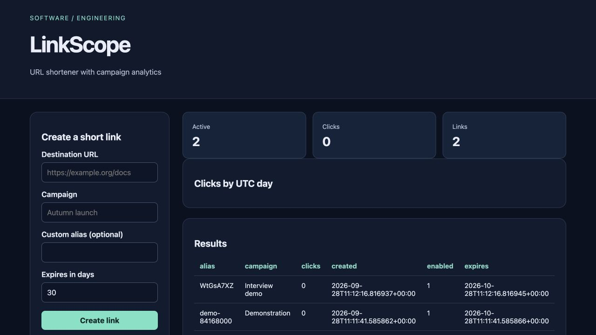

# LinkScope

URL shortener with campaign analytics for **small campaign teams**.

Original topic: **Link Shortener with Analytics Dashboard** from [the source post](https://www.instagram.com/p/DdyMaogE4ud/).

> Local portfolio implementation developed with Codex assistance. Measured results and limitations are documented; no production adoption, revenue or hiring outcome is claimed.



## What works

- Validated links
- expiring aliases
- privacy-preserving click counts
- CSV export

[Example output](reports/example-output.json) · [Verification notes](VERIFICATION.md) · [Learning and interview guide](LEARNING_GUIDE.md)

## Start

Python 3.12 is the validated Python runtime. Run commands from this repository directory. Windows users activate `.venv\Scripts\activate` instead of `source`.

```sh
python3.12 -m venv .venv
source .venv/bin/activate
python -m pip install -r requirements.txt
python app.py
```

Open **http://127.0.0.1:8080**. Keep the process running. Set `PORT` to use another port. The Python development servers are intended for local demonstrations.

## Demonstration

Create a link to https://example.org/docs with alias docs-demo. Open its /s/docs-demo URL in another tab, refresh the dashboard, and inspect the new UTC-day count. Duplicate aliases are rejected.

## Architecture and decisions

Browser controls → validated Flask API → project analysis/workflow → results and export.

Stack: Flask · SQLite.

1. SQLite transactions keep aliases unique and increment aggregate clicks atomically.
2. Store UTC day and referrer host only; visitor identifiers and full referrer URLs are discarded.
3. Accept only HTTP(S) destinations and enforce expiration at redirect time.

## Verification

```sh
python -m pytest -q
```

See [VERIFICATION.md](VERIFICATION.md) for actual executed checks, setup verification, model/data results and any outstanding environment limitations. The [recorded CI runs](reports/ci-verification.json) passed for the linked source revision.

## Data and attribution

Synthetic links; local click events. See [DATA_AND_SOURCES.md](DATA_AND_SOURCES.md) for provenance and usage notes. Original project code is MIT unless a preserved source file or dependency states otherwise. Model and third-party data licenses remain separate.

## Limitations and next improvement

Local single-user administration; no accounts, custom domains, abuse detection, bot filtering or unique-visitor estimates. A click count is a request count, not a human count.

Suggested extension: Add a campaign filter to the analytics query and prove its totals reconcile to the unfiltered result.

## Honest portfolio use

This implementation and documentation were developed with substantial Codex assistance. Before presenting it, run the demonstration, explain the design choices, and complete the suggested independent modification. Do not describe generated code as work experience, an accepted upstream contribution, or a deployed production service.
